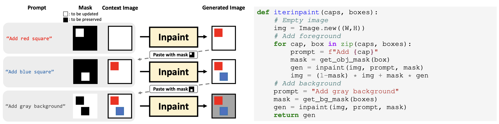
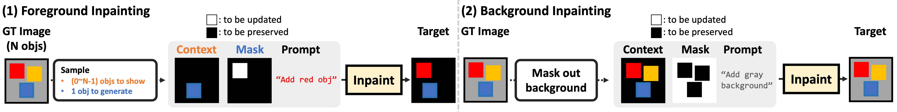

# IterInpaint

The code for **IterInpaint**, a new baseline for layout-guided image generation, as described in the paper:

**[Diagnostic Benchmark and Iterative Inpainting for Layout-Guided Image Generation](https://layoutbench.github.io/)**

[Jaemin Cho](https://j-min.io),
[Linjie Li](https://www.microsoft.com/en-us/research/people/linjli/),
[Zhengyuan Yang](https://zyang-ur.github.io/),
[Zhe Gan](https://zhegan27.github.io/),
[Lijuan Wang](https://www.microsoft.com/en-us/research/people/lijuanw/),
[Mohit Bansal](https://www.cs.unc.edu/~mbansal/)

[[Project Page](https://layoutbench.github.io/)]
[[Paper](https://arxiv.org/abs/2304.06671)]
[[Demo](#inference-demo)]





# Setup Environment

```bash
conda create -n iterinpaint python=3.9
conda activate iterinpaint

pip install torch torchvision
pip install -r requirements.txt
```


# 🧨 Diffusers support

We provide [Huggingface Diffusers](https://github.com/huggingface/diffusers) checkpoint for IterInpaint, where you can simply load our model as follows:

```python
from diffusers import StableDiffusionInpaintPipeline
pipe = StableDiffusionInpaintPipeline.from_pretrained('j-min/IterInpaint-CLEVR')
```

# Inference Demo

We provide demos for IterInpaint inference, where you can generate images with your own custom layouts.

[Inference with Diffusers](./inference_iterinpaint_diffusers.ipynb) - You can run this notebook on Colab.

[Inference with original LDM codebase](./inference_iterinpaint.ipynb) - You need 12GB+ CPU memory to build model (you would need Colab Pro).


# Training IterInpaint on CLEVR



We provide pretrained checkpoints for IterInpaint on CLEVR.
- Original checkpoint: https://huggingface.co/j-min/IterInpaint-CLEVR-original
- Diffusers version: https://huggingface.co/j-min/IterInpaint-CLEVR

Below, we provide the instructions for training IterInpaint on CLEVR.

## 1) Download SD checkpoint

```bash
mkdir preload_model_checkpoints
cd preload_model_checkpoints

# By default, we use SD v1.5 inpainting checkpoint as starting point (https://huggingface.co/runwayml/stable-diffusion-inpainting).
wget https://huggingface.co/runwayml/stable-diffusion-inpainting/resolve/main/sd-v1-5-inpainting.ckpt

# You can replace it with other checkpoint, such as SD text2image from https://huggingface.co/CompVis/stable-diffusion-v-1-4-original
# wget https://huggingface.co/CompVis/stable-diffusion-v-1-4-original/resolve/main/sd-v1-4-full-ema.ckpt
```

## Run Training

We train IterInpaint on 16 V100 GPUs (2 nodes x 8 GPUs at each node) with batch size 1 per GPU, gradient accumulation of 8. We train IterInpaint for 20K steps with the effective batch size of 128 (=16 x 8).

We update U-Net and CLIP text encoder parameters, while freezeing the autoencoder.

You can check and change other hyperparameters in the config file (configs/stable-diffusion/v1-finetune_clevr_iterinpaint_SD15.yaml).


```bash
config='configs/stable-diffusion/v1-finetune_clevr_iterinpaint_SD15.yaml'
SD_starting_checkpoint='preload_model_checkpoints/sd-v1-5-inpainting.ckpt'
data_root='datasets/clevr_data'
lr=1e-4
fg_task_ratio='030'
job_name='iterinpaint_CLEVR_FG30'
save_dir='results'
batch_size=1

python main.py
  --base $config
  --train
  --nodes 2
  --gpus 0,1,2,3,4,5,6,7
  --actual_resume $SD_starting_checkpoint
  --name $job_name
  --data_root $data_root
  --val_data_root $data_root
  --no-test true
  --lr $lr
  --batch_size $batch_size
  --logdir $save_dir/$job_name
  --fg_task_ratio $fg_task_ratio
  --seed 42
```

## (optional) Convert LDM-based checkpoint to HF diffusers format

```bash

# checkpoint output path from training
ckpt_path=xxxx.ckpt
config_file=xxxx.project.yaml

# output path for HF diffusers checkpoint
dump_path=DUMP_PATH

python convert_iterinpaint_ldm_checkpoint_to_diffusers.py \
  --checkpoint_path $ckpt_path \
  --original_config_file $config_file \
  --image_size 512 \
  --prediction_type 'epsilon' \
  --pipeline_type 'FrozenCLIPEmbedder' \
  --extract_ema \
  --dump_path $dump_path
```


# CLEVR inference

```bash
dump_dir='eval_images_dump/clevr'
config='configs/stable-diffusion/v1-inference-iterinpaint.yaml'
run_name='iterinpaint_guidance4.0'

torchrun \
  --nnodes=$n_nodes \
  --nproc_per_node=$n_gpus \
  scripts/clevr_inference.py \
  --eval_data 'clevr' \
  --plms \
  --scale 4.0 \
  --config $config \
  --ckpt $ckpt_path \
  --clevr_dump_dir $dump_dir \
  --save_bbox_viz \
  --name $run_name
```


# LayoutBench inference

```bash
skill_split='number_few' # Change to other skill splits
dump_dir='eval_images_dump/layoutbench'
config='configs/stable-diffusion/v1-inference-iterinpaint.yaml'
run_name='iterinpaint_guidance4.0'

torchrun \
  --nnodes=$n_nodes \
  --nproc_per_node=$n_gpus \
  scripts/clevr_inference.py \
  --eval_data 'layoutbench' \
  --plms \
  --scale 4.0 \
  --config $config \
  --ckpt $ckpt_path \
  --layoutbench_dump_dir $dump_dir \
  --skill_split $skill_split \
  --save_bbox_viz \
  --name $run_name
```

# Citation

If you find our project useful in your research, please cite the following paper:

```bibtex
@article{Cho2023LayoutBench,
  author    = {Jaemin Cho and Linjie Li and Zhengyuan Yang and Zhe Gan and Lijuan Wang and Mohit Bansal},
  title     = {Diagnostic Benchmark and Iterative Inpainting for Layout-Guided Image Generation},
  year      = {2023},
}
```
